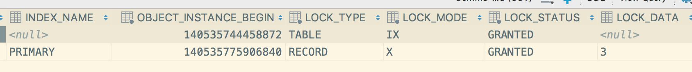
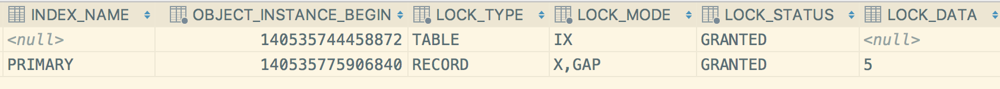
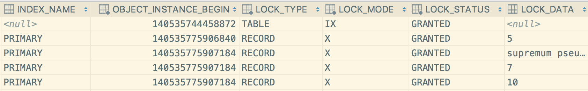
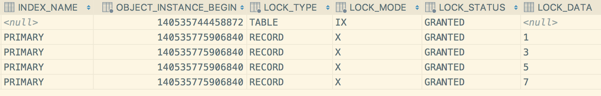
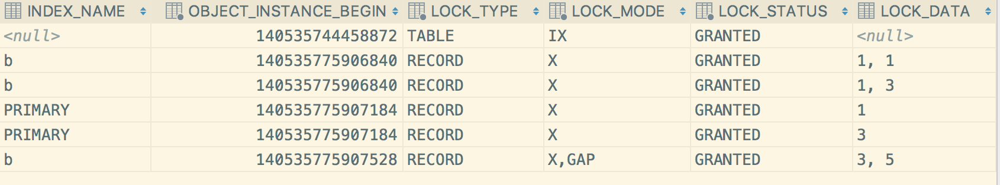

# Innodb 锁分析

## 锁类型

### 共享锁和互斥锁

共享锁和互斥锁，都是Innodb实现的基于行记录的锁。

**共享锁（S Lock）：** 允许事务读取一行记录；

**互斥锁（X Lock）：** 允许事务更新或者删除某行记录；

共享锁和互斥锁的兼容性如下：

| 兼容性 |   S    |   X    |
| :----: | :----: | :----: |
|   S    |  兼容  | 不兼容 |
|   X    | 不兼容 | 不兼容 |

从上面表格可以看出，只有共享锁和共享锁是可以兼容的，而互斥锁和其它都是不兼容。

某个事务A持有行r的S锁，事务B请求获取r的锁情形如下：

1. 事务B请求获取行r的S锁 -- 可以立即获取
2. 事务B请求获取r的X锁，那么事务B就会阻塞并等待，直到事务A将行r上的S锁释放；

### 意向锁

除了上述的行级别的锁以外，Innodb还提供了表级别的锁，即意向锁。

意向锁与行锁对应，也有两个，分别为**意向共享锁（IS）**和**意向互斥锁（IX）**。

**意向锁的主要作用 :**
官网给出的解释如下，`The main purpose of intention locks is to show that someone is locking a row, or going to lock a row in the table.`

翻译过来的解释就是：暗示当前事务接下来需要对行记录加上的锁类型。比如：

1. 意向共享锁（IS）：表示事务接下来会对当前表中某些特定的行记录添加一个共享锁（S）；
2. 意向互斥锁（IX）：表示事务接下来会对当前表中某些特定的行记录添加一个互斥锁；
3. 获取行记录的锁之前需要获取对应的表上的意向锁，即获取行的S锁之前，需要先获取表上的IS锁；获取行的X锁之前，需要先获取表上的IX锁；

添加意向锁之后，锁的兼容矩阵如下：

| 兼容性 |  S   |  X   |  IS  |  IX  |
| :----: | :--: | :--: | :--: | :--: |

| S     | 兼容   | 不兼容  | 兼容  | 不兼容
| X     | 不兼容  | 不兼容 | 不兼容 | 不兼容
|IS     | 兼容    | 不兼容 | 兼容| 兼容
|IX     | 不兼容  | 不兼容|兼容|兼容

表中IS锁和S锁、X锁比较时，S锁和X锁都表示表级别的S锁和X锁。

我们在看上述兼容矩阵时需要注意，表级别的锁只和表级别的锁存在兼容性比较，同理行级别也是。不同粒度之间的锁不存在兼容性的比较，即表上IX锁，并不会阻塞行记录上获取S锁或者X锁。

意向锁不会阻塞除了全表扫描（如：` LOCK TABLES ... WRITE)`）以外的任何请求。

### 记录锁

记录锁，也就是我们通常所说的行锁。它总是会在行记录对应的**索引**上添加锁，而不是对记录本身添加锁。

如果某个表没有定义索引行，那么innodb会给每行记录添加一个隐藏的聚簇索引（类似主键），然后再通过对这个索引进行锁定。

### 间隙锁

间隙锁（Gap Lock），是一种对**索引之间**的间隙进行锁定的锁。即它锁住的是索引之间的间隙，而不是记录。

gap锁之间是互相兼容的，比如一个S gap锁和一个X gap锁是互相兼容的。这样做的原因是，如果某个索引两边的gap锁由两个事务持有，这时将这个索引删除了，那么这个索引两边的gap锁就需要合并。

间隙锁是只有在RR隔离级别下才会存在，主要是为了防止插入操作，也就是为了避免幻读而引入的锁。

例如：`SELECT c1 FROM t WHERE c1 BETWEEN 10 and 20 FOR UPDATE;` 这时事务会获取一个gap锁，其它事务的向10-20之间添加记录的请求都会被阻塞。

由于gap锁是锁住索引之间的间隙的，所以和记录锁之间是不冲突的。即获取索引的S锁或者X锁，和索引之间有无gap锁无关。即gap锁不会影响X锁和S锁。

gap锁对于根据**唯一索引**查询**唯一记录**时是不会出现的，例如`select * from t where id = 100;`

但是下面这几种情况是添加gap锁的：

1. 根据唯一索引查询，但是查询是某个范围，如：`select * from t where id > 100 for update;`
2. 唯一索引有多个列时，查询条件并没有覆盖唯一索引的所有列，如：存在唯一索引(a,b)，查询`select * from t where a = 10 for update;`
3. 使用非唯一索引查询时，必定会出现gap锁，不管查询出的结果是不是只有一行记录。因为gap锁是在索引之间添加的，不是通过记录来锁定的。

上述几种情况只是对gap锁场景的简单描述，后面会具体针对各种SQL导致的锁场景进行详细描述。

### Next-Key Lock

Next-Key锁，是一种记录锁和间隙锁的结合。即通过记录锁来锁住索引时，会同时在**索引之前的间隙**添加gap锁。

官网给出的Next-Key Lock的定义：`A next-key lock is a combination of a record lock on the index record and a gap lock on the gap before the index record.`

例如： 某个表包含的索引值有10，11，13，20，那么可能出现的Next-Key Lock如下

	(negative infinity, 10]
	(10, 11]
	(11, 13]
	(13, 20]
	(20, positive infinity)

从上可以看出，如果是对索引11加上Next-Key Lock那么就会锁定索引11，并且锁定它之前的范围`(10，11)`，所以就是`(10,11]`。

同样Next-Key Lock也只存在于RR隔离级别下。

### 插入意向锁

插入意向锁（insert intention Locks），也是一个间隙锁的一种，是通过insert操作产生的。

插入意向锁表示想要向特定位置插入一条记录，但是多个事务之间如果不是插入的相同的记录，那么这个特殊的间隙锁是不会阻塞其它事务的操作的。

例如：有索引4，7，我们分别用两个事务向其中同时插入5，6两条记录，那么两个事务都会获取（4，7）之间的插入意向锁，但是彼此并不会阻塞。

根据官网的解释，insert操作在实际插入一条记录之前，会先尝试获取一个插入意向锁，之后再获取该记录的互斥锁（非Next-Key Lock）。

如果insert操作的时候出现了duplicate-key error，那么事务就获取这个索引上的一个S锁。这种情况下就会出现死锁的可能，具体死锁场景后面分析。

### 自增锁

自增锁是一个表级别的锁，所有事务的请求都会依次获取这个锁，但是这个锁并不会在事务释放之后才释放，而是在将新的值写回表中之后就释放了。

## 锁场景分析

对于锁场景的分析，需要先交待清楚当前事务的隔离级别。抛开事务隔离级别去谈锁就是耍流氓~~

由于RR的隔离级别是MySQL的innodb默认的隔离级别，所以我们就基于RR级别来看下各种SQL对应的加锁场景。

对于升级到MySQL8.0的同学来说，可以通过查看`performance_schema.data_locks` 表来查看各个事务持有的锁情况。

### select 语句

#### select ... from

`select ... from ` 这个语句是我们最常用的语句，这个语句在RR及以下的级别是不会添加任何锁的。所以`select ... from` 语句是不会被阻塞的。

语句每次都是读取的最新的一个快照数据，即最近的一个事务提交之后的数据，事务未提交的数据是不会被读取到的。

#### select ... for update 和 select ... for share

这个两个语句都会添加锁，并且都是行锁。
`select ... for update` 会在索引上添加一个X锁。
`select ... for share` 会在索引上添加一个S锁。

由于查询的条件不同（where语句），实际加锁的情况可以概括为两种情形：

1. 唯一索引下查找的唯一记录
2. 范围查询

这里我们需要注意判断当前SQL到底使用的是哪个索引。在复杂SQL查询下，我们可以通过`explain`命令来查看SQL具体的执行计划，以及使用到的索引。

给出表结构如下：

		create table z
	(
	  a int not null
	    primary key,
	  b int null
	);
	
	create index b
	  on z (b);

添加数据如下：

	INSERT INTO z SELECT 1,1;
	INSERT INTO z SELECT 3,1;
	INSERT INTO z SELECT 5,3;
	INSERT INTO z SELECT 7,6;
	INSERT INTO z SELECT 10,8;

##### 唯一索引 + 唯一数据

我们查询的语句的条件使用了唯一索引，并且是等值查询的情况下，innodb会给当前查询到的记录添加一个X锁，不会有gap锁。

如：`select * from z where a = 3 for update`，只会在a = 3的索引上添加一个X锁。通过`performance_schema.data_locks` 表可以更清楚看到事务持有的锁。事务会持有一个表级别的`IX锁`，同时还会在主键索引上添加一个`X锁`。

但是如果当前查询的记录不存在的话，就会在不存在记录的前后两条记录之间添加一个gap锁。如下:

从上述表中展示的结果中，以及从其他资料查阅，我这里有个关于gap锁的猜想 -- 就是MySQL的Gap锁其实是和其它的锁一样，是添加到索引上的，不过锁的类型是gap。每次执行insert操作的时候会去校验插入的记录的下条记录上是否存在gap锁，如果存在gap锁就等待，否则就直接插入成功。

不过这个仅是我的个人猜想，没有文档和书籍中提到过这个，如果要验证这个猜想只能通过查看MySQL的源码来分析了。

##### 唯一索引 + 范围查询

通常情况下，是用唯一索引等值查询时，只会在记录上添加一个X锁。但是对于使用唯一索引，但是查询条件是`> < between ... and`之类的范围查询时，就会在记录上添加Next-key Lock，即锁住当前索引，并且将之间的间隙进行锁定。

如：`select * from z where a >= 5 for update`

因为`a >= 5`的索引有`5，7，10`，所以会在这些索引上添加X锁，同时会在这些索引的间隙上添加间隙锁，即`(5,7) , (7,10), (10, +∞)`，在这些范围都是无法insert数据的，大家可以尝试下。

再看一个示例：`select * from z where a <= 5 for update`

这个地方很奇怪，明明是对`a <= 5`进行加锁，为何会需要将a为7的索引也加上锁，这个地方我暂时也没想通，留个问题，后面再尝试解决~~

##### 非唯一索引

对于非唯一索引查询的场景下，某个值的索引可能会出现多个，比如上述表中的索引b，就存在多个值
为1的索引。

所以这种情况就和上述的`唯一索引 + 范围查询比较类似了`，这个时候也会使用`Next-key Lock`对非唯一索引进行加锁。即在索引上加记录锁，同时在索引间隙添加gap锁。再这个辅助索引上添加锁之后，MySQL还需要对相应的主键添加记录锁，这是为了防止其它直接通过主键或其它查询条件来锁定同样记录的场景。

如：`select * from z where b = 1 for update`

对辅助索引`b=1`添加了X锁，同时`b=1`和`b = 3, a =5`之间添加了gap锁，同时将主键`a=1, a=3`添加了X锁。

这时，如果要执行`INSERT INTO z SELECT 4,1`、`INSERT INTO z SELECT 6,1` 之类的操作都不会被允许，因为（4，1）和（6，1）不会获取到 `b=1`上的X锁，所以不可能会添加成功。

再看语句`INSERT INTO z SELECT 4,3`和`INSERT INTO z SELECT 6,3` 前者会阻塞，但是后者却可以执行成功，不会阻塞。正如之前猜想的一样，这时因为在记录`a =5, b = 3`上存在一个gap锁，所以`INSERT INTO z SELECT 4,3`语句在insert数据时判断它的下条记录存在gap锁，所以无法添加，就等待下个记录的gap锁释放。而`INSERT INTO z SELECT 6,3` 这个语句可以执行是因为它的下条记录（7，6）不存在gap锁，所以可以正常添加。

这个时候对于主键的锁，因为都是唯一索引，索引主键上不会存在gap锁，所以这个时候执行语句`select * from z where a = 5 for update` 不会被阻塞，也没有锁冲突。

非唯一索引的范围查询和其它的范围查询也比较类似，都是添加的`next-key lock`

### update 、delete 语句

其实了解了上述语句的加锁，那么`update`和`delete`语句的加锁基本也就会了。

`update`和`delete`都会给记录添加**X锁**或者**Next-Key Lock**，加锁逻辑也是按照`where`条件中的索引来判断的，判断逻辑和上述的几种场景一致。

### insert 语句

**insert**语句会在插入记录之前添加一个`insert intention lock`，然后再在记录上添加一个`X锁`。

但是有种特殊的情况，即如果`insert`的时候出现了`duplicate error`，那么当前事务就会获取一个重复记录索引上的`S锁`。由于这种场景的存在，就有可能会导致死锁的发生。

****

对于常用的RC隔离级别，其实与RR的区别不是特别大，只是去掉了Gap锁。所以对于上述分析的各个场景中，大家只要将gap锁忽略，就是RC级别下的锁状态了。

## 死锁分析

### 死锁原因

死锁的直接原因通常都比较简单，两个或者多个事务之间互相持有对方需要的锁。比如：事务1持有锁A请求锁B，同时事务2持有锁B请求锁A，这样就出现了常见的死锁。

#### 场景分析

表结构还是使用上述的表`z`

##### 场景1 : 锁队列导致的死锁

第一步：事务1
	

	begin;
	select * from z where a = 5 for share; //获取a=5上的S锁

第二步：事务2

	begin;
	select * from z where a = 5 for update; //请求获取a=5上的X锁，因为事务1持有a=5上的S锁，所以事务2锁等待

第三部：事务1

	select * from z where a = 5 for update; //死锁发生，事务2回滚

因为事务1持有`a=5`记录的S锁，并请求获取a=5上的X锁，但是a=5这条记录的X锁队列中存在事务2，所以事务1无法获取记录的X锁，需要等待事务2将X锁释放。但是事务2的X锁获取又依赖事务1的S锁释放，所以就出现了饥饿，导致了死锁。

官网类似案例如下：[deadLock example](https://dev.mysql.com/doc/refman/5.7/en/innodb-deadlock-example.html)

##### 场景2 ：duplicate insert 导致的死锁

第一步：事务1

	begin;
	INSERT INTO z SELECT 11,8; //插入成功，获取了索引a=11的X锁

第二步：事务2
	

	begin;
	INSERT INTO z SELECT 11,8; //因为事务1占有a=11的X锁，这是事务2等待获取a=11的S锁

第三步：事务3
	

	begin;
	INSERT INTO z SELECT 11,8; //同样等待获取a=11的S锁

第四部：事务1
	

	rollback; //死锁发生

因为事务1先添加了a=11这条记录，后续事务因为添加相同的记录，存在duplicate，所以转而不获取a=11的S锁。之后，因为事务1回滚，释放X锁，这时事务2和事务3同时获取S锁，并同时需要将S锁升级为X锁，但是因为X锁和S锁不兼容，所以事务2和事务3需要互相等待对方将S锁释放，所以导致死锁。

##### 场景3：复杂场景的死锁

这是一个真实的线上死锁案例。

表结构大概如下：
	

	create table t
	(
	  a  int   auto_increment not null 
	    primary key,
	  b int null,
	  c int null,
	  unique key uk_bc(b,c)
	);

数据如下：
	

	insert into t value (null , 1, 1, 3);
	insert into t value (null , 1, 2, 4);
	insert into t value (null , 1, 3, 5);
	insert into t value (null , 1, 4, 6);

第一步：事务1

	begin;
	insert into t value (null , 1, 4, 6); //尝试插入一个重复值，这时报错，并获取一个索引（b,c）=（1，4）上的S锁

第二步：事务2

	begin；
	update t set d = 4 where b = 1 and d = 4; 
	//尝试更新，并且由于查询条件只使用了索引b，所以需要锁定所有b=1的索引行。因为MySQL加锁是逐条锁定的，所以事务2这时会对（1,1),(1,2),(1,3)的依次加X锁，但是由于事务1持有（1，4）记录的S锁，所以等待（1，4）的X锁。

第三步：事务1

	update t set d = 4 where b = 1 and d = 5; 
	//尝试更新b=1，d=5的记录，同时也是由于只使用了索引b，所以这时需要获取索引b上的X锁，由于加锁顺序是从小到大添加，事务1这时需要获取(1,1)的X锁，但是由于事务2持有（1，1）的X锁，所以锁等待。

这时事务1和事务2互相持有对方需要的锁，最终导致了死锁。

##参考文献：

	mysql官方文档；
	MySQL技术内幕：Innodb 存储引擎（第二版）

