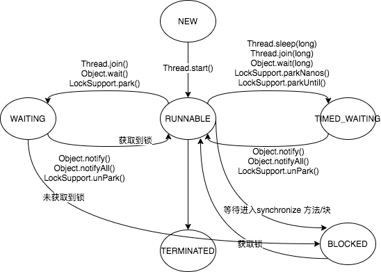
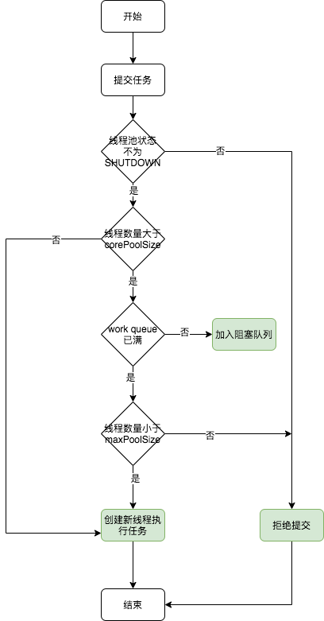
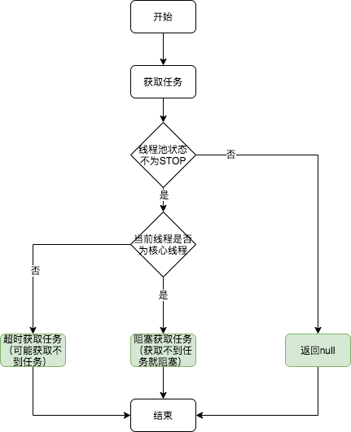

## 并发问题

### 并发问题的本质

并发问题出现的场景：多个线程对共享资源的操作出现的问题


### 并发导致的问题（线程问题）

**安全性问题**：当多个线程访问某个类时，该类不能始终表现出**正确的行为**（正确性的含义：某个类的行为与其规范完全一致）；（线程安全的否定定义）

个人理解：就是一个类在单线程中的行为或表现即为正确性，如果某个类在多线程的环境下的表现与单线程下表现一致，那么该类就是线程安全的；

**活跃性问题**：某个无法继续执行下去，就会导致活跃性问题；

多线程环境下出现的场景一般就是死锁、饥饿、活锁等

**性能问题**：引入多线程却并没有解决或达到想要的性能目标


## 线程安全性问题与解决方案

#### 可见性、原子性、有序性的定义

**可见性**：一个线程对共享变量的修改，其它线程可以立刻看到

**原子性**：一个或多个操作在CPU执行过程中不能被中断的特征（线程切换依赖CPU中断）

**有序性**：程序按照代码的先后顺序执行


#### 导致线程安全性的本质原因

1. **可见性问题**：多核CPU对应的高速缓存与主内存数据不一致的问题；
2. **原子性问题**：高级语言与CPU指令执行的不一致（count++操作对应多个CPU指令），线程切换导致的CPU中断，无法保证高级语言的原子性；
3. **有序性问题**：编译器对指令进行重排，导致代码执行的顺序与实际执行顺序的不一致；


### 线程安全的解决方案

Java内存模型：规范对变量的存取规则，主要是围绕着并发过程中如何处理可见性、原子性、有序性这三个特征来建立的；


#### Happens-before规则

比较晦涩的，建议结合示例去理解；

主要是掌握内存模型对volatile、synchronize、final 三个关键字的内存可见性的处理；

**定义**：如果A操作在B操作之前发生，那么A操作产生的结果对于B就是可见的；（其实是一系列关于可见性的规范）

happens-before的规则就是规定了哪些场景是先行操作；


**volatile变量规则**

1. 可见性保证：对volatile变量的修改会立即对其它线程可见（volatile的写操作会将结果直接写到主内存中）
2. 禁止指令重排优化：volatile的使用会插入内存屏障，并保证编译器不会对指令进行重排


**1. 程序的顺序性规则（一般和传递性规则一起用）**

**定义：**在一个线程中，按照程序顺序，前面的操作 Happens-Before 于后续的任意操作；

注意：顺序性的规定是从线程内部视角看是有序即可，此处的有序是指后面代码对前面代码中变量的依赖是得到保证的（有依赖关系的前提下）；

程序的执行顺序的调整不对程序的结果产生影响，那么就可以认为是有序的；即某段代码从程序内部看是有序的，但从外部线程看是无序的；

**2. volatile变量规则**

**定义**：对一个volatile变量的写操作， Happens-Before 于后续对这个volatile变量的读操作。


**3. 传递性**

**定义**：如果A Happens-Before B，且B Happens-Before C，那么A Happens-Before C；

注意：根据规则1、2、3可以看出，所有在volatile之前的写操作的结果，都会被刷入到主内存中；（所以volatile之前的变量也起到了volatile的作用）


**示例1：**

```java
class VolatileExample {
  int x = 0;
  //注意此处有volatile
  volatile boolean v = false;
  public void writer() {
    x = 42;
    v = true;
  }
  public void reader() {
    if (v == true) {
      // 这里x会是多少呢？
    }
  }
}
```

场景：线程A调用writer()、线程B调用reader()，那线程B在判断中看到的x值是多少？如果没有volatile修饰，那x值是多少？

答案：有volatile场景下为42；没有volatile场景下可能是0或42；

分析：

1. 由于v被volatile修饰，所以volatile会禁止指令重排，所以x=42的赋值是发送在v=true之前，再传递性规则，得到x=42；（可以理解为volatile之前的数据会被全部刷入内存中了）
2. v被volatile修饰的话，可能会出现内部指令的重排序，所以x的值可能是0或42；当前CPU缓存的问题也可能导致x看到的是0；


**4. 管程中锁的规则**

**定义：**一个unlock操作先行发生于后面对同一个锁的lock操作；

注意：该规则定义了对synchronize的可见性


#### 解决可见性与有序性的问题

Java通过volatile、final与happens-before规则解决了可见性与有序性的问题


#### 解决原子性问题

Java通过加锁的方式解决了原子性的问题；即同一时间只有一个线程可以获取临界资源，避免了多线程的操作；


## 线程

### 线程状态

**线程状态定义**

NEW、RUNNING、BLOCKED、WAITING、TIMED_WATING、TERMINATED

此处线程状态的定义均为jdk中线程状态的定义，与操作系统定义的线程状态并不完全一致

**NEW** : 初始状态，线程刚刚创建时刻的状态，还没有调用start() 方法

**RUNNABLE** ：运行状态，线程被Java虚拟机执行时候的状态，此状态对应操作系统线程的就绪和运行状态*

**BLOCKED** ：阻塞状态，线程在等待监视器上的锁，对应进入synchronize代码块，等待获取锁

**WAITING** ：等待状态，线程在等待其它线程给出一些特定动作（通知或中断），对应调用Object.wait()、Thread.join()、LockSupport.park() 时会进入该状态

**TIMED_WAITING** : 超时等待，与WAITING状态类似，不过超时会自动唤醒，然后进入BLOCKED 状态（未获取锁）或RUNNABLE状态（获取到锁），对应调用Thread.sleep(long)、Object.wait(timeout)、Thread.join(long)、LockSupport.parkNanos()、LockSupport.parkUntil() 时进入该状态

**TERMINATED** ：终止状态，线程执行完毕


**线程状态转换**



**注意**：Thread.sleep() 方法线程状态为TIME_WAITING 但是不会释放对象锁，Object.wait() 方法会释放对象锁


**线程操作**

interrupt()；

join();


### 线程池

#### 是什么？解决什么问题？

**是什么**：线程池是一种池化思想，实现对线程资源的管理；

**解决问题（仅个人理解）**：为了对线程资源进行管理；

1. 线程创建和销毁成本较高；
2. 如果不对线程资源进行管理会有系统风险（无限制创建线程造成资源枯竭）；
3. 同一系统内会造成资源的竞争（未做资源隔离），比如不重要的功能占用过多线程资源导致核心功能受到影响；


#### 线程池工作原理

Java中线程池的框架主要为Executor和ExecutorService，对应的实现类为ThreadPoolExecutor；

**框架核心思路**：将**任务提交过程与任务执行过程**进行分离；


##### 线程池参数

corePoolSize：核心线程数

maximumPoolSize：最大线程数

keepAliveTime：保活时间

workQueue：阻塞队列，核心线程数满了之后，再提交的任务会放入该队列中

了解各个参数的含义与使用


##### 线程池状态（生命周期）

RUNNING、SHUTDOWN、STOP、TIDYING、TERMINATED

RUNNING：

SHUTDOWN:

STOP:

TIDYING:

TERMINATED:


##### 线程池执行过程

上面提到了Java中线程池设计的核心思路是**任务提交**与**任务执行**

**任务提交**




任务提交主要涉及到线程池的核心参数，所以需要理解线程池的核心参数及作用

**任务获取**



注意：**非核心线程**在获取任务时是调用阻塞队列的**超时获取（时间即为keepAliveTime）**，如果超时未获取到任务则线程就会被回收；


**任务执行**


**线程池关键点：**

1. 工作线程的生命周期：线程的创建与线程的销毁
2. 任务的提交与任务的获取


### 线程中断与取消


## Java并发工具类

#### synchronize

**原理**：synchronize是通过对**Java对象**进行加锁的，加锁形式包括：

1. 静态同步方法 ： 当前类的Class对象
2. 非静态同步方法 ：当前实例对象
3. 同步方法块 ：synchronize括号中的对象


Java使用了管程（monitor）的思想来实现对互斥的功能，使用了操作系统的mutex原语，所以每次加锁都需要由用户态切换到内核态中进行；

同时阻塞和唤醒一个线程，也是需要进行内核态与用户态的切换；

管程中维护了一个同步队列（entry set，获取锁失败后进入的队列）和 多个条件队列（调用wait之后的等待队列，但是Java的实现只使用了一个条件队列）；


**等待通知**

wait() ：将当前线程放置入条件队列中

notify()、notifyAll() ：唤醒条件队列中的线程，获取不到资源则放入同步队列中（非公平锁）；


**锁优化与锁升级**

**偏向锁**：

加锁过程：修改对象头中的mark Word，并将线程Id指向当前线程；如果mark word存在值，但线程已经销毁，则直接修改mark word；

锁升级：存在锁竞争时，会撤销偏向锁，将锁升级为轻量级锁；

**轻量级锁**：

加锁过程：持有偏向锁的线程，将继续获取锁，同时修改mark word信息，并在当前线程栈中拷贝mark word信息；未获取到锁的线程则进行自旋，等待锁

锁升级：如果自旋超过一定次数之后或存在第三个线程来进行锁竞争，会进行锁升级，将未获取到锁的线程挂起（防止CPU空转）；

**重量级锁**

加锁过程：调用操作系统的mutex原语，切换到内核态中进行操作；


偏向锁是假想没有锁竞争的场景，所以直接通过修改对象头的方式进行加锁；

轻量级锁是假想有一定的锁竞争（两个线程之间的竞争），但是竞争时间很短（通过自旋等待一定时间即可获取到锁）；

重量级锁是悲观锁，认为存在锁竞争。


#### Lock

通过AQS实现的自定义锁，支持锁重入、锁中断、锁超时、锁重入、公平锁等的实现


#### synchronize与Lock对比

1. synchronize不需要手动释放锁，Lock需要手动加锁和释放
2. Lock可以实现锁超时、锁中断、公平锁、读写锁、锁重入
3. synchronize只支持一个条件队列，Lock通过创建Condition可以支持多个条件队列


#### AQS

通过CAS + 同步队列 +  条件队列 实现的；可以与 synchronize的实现做对比


#### Semaphore

信号量，参考限流的实现


#### CountdownLatch与CyclicBarrier


#### ThreadLocal


#### 并发集合

**ConcurrentHashMap**


**ConcurrentLinkedQueue**


**CopyOnWriterArrayList**


#### 原子类


## 应用

### 生产者-消费组模型


### 限流器


## 参考资料

《Java并发编程实战》

《深入Java虚拟机》


## TODO

**管程（monitor）的概念和使用？（参考操作系统概念）**

https://www.cnblogs.com/binarylei/p/12544002.html


**为什么Thread.sleep() 没有释放资源？**


**线程池的执行过程**


**Lock的await()与synchronize的wait实现的区别**


**final对象或final域的初始化**


**静态内部类的加载过程**


**定时执行框架**
